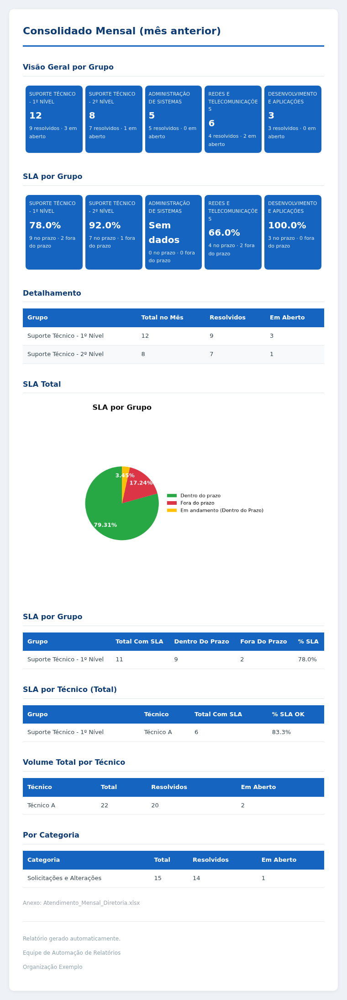
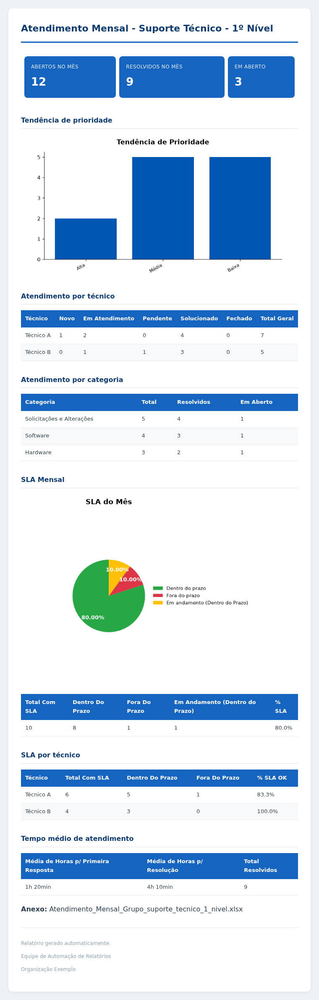
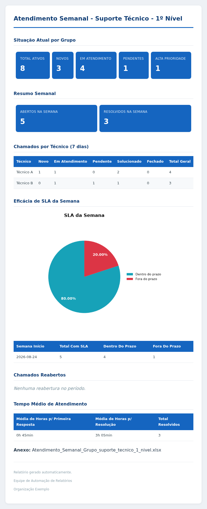
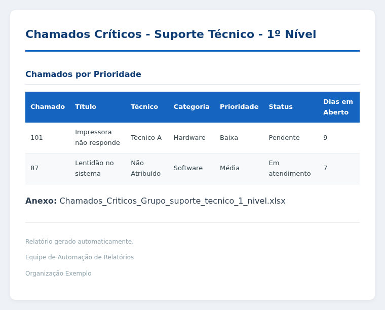
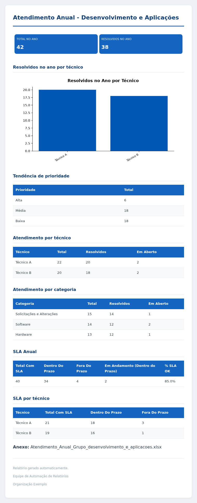

# Automação de Relatórios GLPI

Extrai dados de views MariaDB do GLPI, gera planilhas Excel e envia relatórios por e-mail (HTML + gráficos embutidos), com agendamento independente por relatório via systemd timer.

[](https://www.python.org/)
[](https://mariadb.org/)
[](https://pytest.org/)
[](https://docs.astral.sh/ruff/)
[](https://www.debian.org/)
[](https://www.zabbix.com/)

## Sobre o projeto

Substitui a coleta e o envio manual de métricas de atendimento do GLPI (mensal, semanal, anual e chamados críticos) por uma rotina automatizada, agendada e monitorada.

Cobre cinco grupos — **Suporte Técnico - 1º Nível**, **Suporte Técnico - 2º Nível**, **Administração de Sistemas**, **Redes e Telecomunicações** e **Desenvolvimento e Aplicações** (ver `config/groups.py`) —, cada um recebendo só seus próprios dados, mais um consolidado mensal para a diretoria.

## Relatórios disponíveis

| Relatório | Tipo | Grupos | Periodicidade |
|---|---|---|---|
| `atendimento_criticos_grupo` | por grupo | os 5 grupos | segunda e quinta, 08:00 |
| `atendimento_semanal_grupo` | por grupo | os 5 grupos | toda segunda, 08:00 |
| `atendimento_mensal_grupo` | por grupo | os 5 grupos | dia 1º do mês, 08:00 |
| `atendimento_anual_grupo` | por grupo | os 5 grupos | 1º de janeiro, 08:00 |
| `relatorio_mensal_diretores` | consolidado | todos os grupos numa query só | mensal, para a diretoria |

Um relatório `por grupo` gera **um e-mail por grupo** na mesma execução — não existe uma entrada em `REPORTS` por grupo. Lista sempre atualizada em `config/reports.py`.

## Capturas de tela

Prints dos e-mails gerados pelo pipeline (dados fictícios, gerados via `preview_template.py`). Clique em cada um para expandir:

<details>
<summary><strong>Consolidado mensal (diretoria)</strong></summary>
<br>

</details>

<details>
<summary><strong>Atendimento mensal por grupo</strong></summary>
<br>

</details>

<details>
<summary><strong>Atendimento semanal por grupo</strong></summary>
<br>

</details>

<details>
<summary><strong>Chamados críticos por grupo</strong></summary>
<br>

</details>

<details>
<summary><strong>Atendimento anual por grupo</strong></summary>
<br>

</details>

## Arquitetura

```
main.py --report <nome>
   │
   ├─► config/reports.py            → configuração do relatório (queries, template, destinatários)
   ├─► services/reporter_runner.py  → orquestra as etapas abaixo, na ordem
   │      ├─► services/periodos.py       → data de início/fim (semanal/mensal/anual)
   │      ├─► services/database.py       → executa as queries no MariaDB → DataFrames (pandas)
   │      ├─► services/excel_service.py  → gera o .xlsx (uma aba por dataset)
   │      ├─► services/charts.py         → gráficos (pizza/barras) como PNG
   │      ├─► services/report_renderer.py→ tabelas HTML + KPIs para o template
   │      └─► services/mailer.py         → conecta no SMTP e envia
   │              ├─► services/renderer.py      → Jinja + CSS inline (premailer)
   │              └─► services/email_builder.py → MIME (corpo, imagens inline, anexo)
   └─► services/logger.py           → logging centralizado (console + arquivo), em todas as etapas
```

Cada relatório é uma entrada no dicionário `REPORTS` (`config/reports.py`), em dois formatos:

- **Normal**: uma execução, um Excel, um e-mail (ex: consolidado da diretoria).
- **Por grupo** (`"tipo": "por_grupo"`): as mesmas queries rodam uma vez por grupo em `"grupos"` (injetando `:grupo`), gerando Excel e e-mail **separados por grupo**. Destinatários resolvidos via `config/groups.py`.

As queries SQL não ficam no Python — cada uma é um arquivo `.sql` em `sql/`, referenciado pelo caminho.

## Estrutura do projeto

```
automacaoGLPI/
├── main.py                 # ponto de entrada, aceita --report <nome>
├── preview_template.py     # dev: renderiza um template com dados fictícios
├── config/
│   ├── settings.py         # carrega e valida variáveis do .env
│   ├── groups.py           # grupos GLPI + destinatário por grupo/tipo de relatório
│   └── reports.py          # registro central de relatórios
├── sql/                    # uma query .sql por dataset, por período
├── services/                # database, excel, gráficos, e-mail, retry, logger...
├── templates/               # HTML (Jinja2) + CSS dos e-mails
├── scripts/                 # health check, validação de schema, alertas
├── systemd/                 # units/timers de agendamento
├── tests/
├── zabbix/                  # setup de monitoramento
└── docs/
```

## Tecnologias

| Categoria | Stack |
|---|---|
| Linguagem | Python 3.11+ |
| Banco | MariaDB (views do GLPI), via SQLAlchemy + mysql-connector-python |
| Dados | Pandas |
| Saída | OpenPyXL (Excel), Matplotlib (gráficos), Jinja2 + Premailer (e-mail HTML) |
| Envio | SMTP |
| Execução | Linux/Debian, systemd timers |
| Observabilidade | Logging próprio, Zabbix (zabbix-utils) |
| Qualidade | Pytest, Ruff, GitHub Actions (CI) |

## Instalação

```bash
git clone git@github.com:alinechaves2911/automacao-glpi.git
cd automacao-glpi

python3 -m venv venv
source venv/bin/activate
pip install --upgrade pip
pip install -r requirements.txt
```

Em produção, ajuste o dono dos arquivos para o usuário que roda via systemd:

```bash
sudo chown -R automacaoglpi:automacaoglpi /opt/automacaoGLPI
```

## Configuração (`.env`)

Copie `.env.example` para `.env` e preencha. Restrinja a permissão:

```bash
cp .env.example .env
chmod 600 .env
```

Obrigatórias (validadas em `config/settings.py`, que encerra com mensagem clara se faltar alguma):

| Variável | Descrição |
|---|---|
| `DB_HOST` / `DB_PORT` / `DB_NAME` / `DB_USER` / `DB_PASS` | Conexão com o MariaDB do GLPI |
| `SMTP_HOST` / `SMTP_PORT` / `SMTP_USER` / `SMTP_PASS` / `SMTP_FROM` | Envio de e-mail (Gmail com 2FA exige senha de app) |

Destinatários gerais por grupo (opcionais individualmente; se vazio, só um aviso é logado e aquele e-mail é pulado):

`DESTINATARIOS_SUPORTE_N1`, `DESTINATARIOS_SUPORTE_N2`, `DESTINATARIOS_ADMSIS`, `DESTINATARIOS_REDES`, `DESTINATARIOS_DEV`, `DESTINATARIOS_DIRETORIA`.

Cada grupo aceita também um override opcional por tipo de relatório (`GRUPO_SUPORTE_N1_MENSAL`, `_SEMANAL`, `_ANUAL`, `_CRITICOS`, e assim para os outros 4 grupos — 20 variáveis, todas opcionais, caem no `DESTINATARIOS_*` geral se vazias). Útil para, por exemplo, mandar críticos pro plantão e mensal pro coordenador. Ver exemplo comentado em `.env.example`.

**`.env` nunca é commitado.** Se acabar indo pro histórico do Git, as credenciais devem ser consideradas expostas e rotacionadas — reescrever o histórico depois não basta sozinho.

## Uso manual

```bash
python3 main.py --report atendimento_criticos_grupo

# roda tudo (queries, Excel, gráficos, HTML) sem enviar e-mail de verdade
python3 main.py --report atendimento_criticos_grupo --dry-run

# versão do pipeline em execução
python3 main.py --version
```

`preview_template.py` renderiza um template com dados fictícios direto no navegador — útil pra ajustar layout sem rodar o pipeline inteiro. Não faz parte do fluxo de produção.

## Adicionando um novo relatório

Não exige tocar em `main.py` nem em `services/reporter_runner.py`. Passo a passo completo em [`docs/adicionar-relatorio.md`](docs/adicionar-relatorio.md):

1. Query(s) `.sql` em `sql/<periodo>/` — se for `por_grupo`, filtrar por `WHERE grupo = :grupo`.
2. Template HTML em `templates/`, estendendo `base_email.html`.
3. Entrada em `config/reports.py`.
4. Filtro de data via `:inicio`/`:fim`/`:ano`/`:mes`, calculado por `services/periodos.py`.
5. Timer/service systemd correspondente.
6. Validar: `python3 scripts/verificar_schema.py --sql-dir sql/<periodo>` e `python3 main.py --report <nome> --dry-run`.

## Agendamento via systemd

```bash
# instalar os templates de unit
sudo cp systemd/automacao-glpi-*@.service systemd/automacao-glpi-*@.timer /etc/systemd/system/
sudo cp systemd/automacao-glpi-alerta@.service /etc/systemd/system/
sudo systemctl daemon-reload

# habilitar uma instância por relatório
sudo systemctl enable --now automacao-glpi-critico@atendimento_criticos_grupo.timer
sudo systemctl enable --now automacao-glpi-semanal@atendimento_semanal_grupo.timer
sudo systemctl enable --now automacao-glpi-mensal@atendimento_mensal_grupo.timer
sudo systemctl enable --now automacao-glpi-mensal@relatorio_mensal_diretores.timer
sudo systemctl enable --now automacao-glpi-anual@atendimento_anual_grupo.timer

# depurar
systemctl list-timers 'automacao-glpi*'
journalctl -u automacao-glpi-semanal@atendimento_semanal_grupo.service -f
```

Horário diferente do padrão do template? Use um drop-in:

```bash
sudo systemctl edit automacao-glpi-mensal@relatorio_mensal_diretores.timer
```

```ini
[Timer]
OnCalendar=
OnCalendar=*-*-02 07:00:00
```

(a primeira linha `OnCalendar=` vazia limpa o valor herdado do template, senão os dois horários coexistem)

## Testes e qualidade

```bash
pip install -r requirements-dev.txt
pytest tests/ -v      # 44 testes: periodos.py, report_renderer.py, retry.py
ruff check .
```

CI (`.github/workflows/ci.yml`) roda lint + testes a cada push/PR pra `main`/`develop`.

## Observabilidade e resiliência

- **Logs**: `logs/execucao.log`, rotação automática (5 arquivos × 2 MB), também disponível via `journalctl` por instância systemd. Formato `text` ou `json` (`LOG_FORMAT` no `.env`).
- **Retry/backoff**: conexão MariaDB e handshake SMTP tentam 3x (2s/4s). Erro de autenticação e `sendmail()` **não** entram no retry de propósito (não adianta tentar de novo / risco de duplicar envio).
- **Alertas**: falha num `.service` dispara `OnFailure=` → e-mail + trapper Zabbix (`scripts/alerta_falha.py`).
- **Health check**: `python3 scripts/health_check.py` — confere `.env`, banco, SMTP, disco, diretório de logs.
- **Validação de schema**: `python3 scripts/verificar_schema.py --sql-dir sql/<periodo>` roda `EXPLAIN` em cada query contra o banco configurado.
- **Zabbix**: status/duração/falha de cada relatório monitorados via `zabbix-utils` (setup em `zabbix/README.md`).

Comportamento por dependência externa:

| Se cair... | Comportamento |
|---|---|
| MariaDB | Retry 3x; falha final → exceção sobe, systemd marca falho, dispara alerta. Nenhum relatório sai incompleto. |
| SMTP | Mesmo retry na conexão; falha de autenticação não entra no retry. `.xlsx` gerado é removido mesmo em falha de envio. |
| Zabbix | Pipeline segue normal (é só observador); timeout curto no envio do trap, só logado se falhar. |

## Segurança

- Credenciais só no `.env` (permissão `600`, fora do versionamento — `.gitignore` cobre isso).
- `DB_PASS` mascarado em qualquer mensagem de erro logada (`services/database.py`).
- Rotação de credencial: trocar na origem → atualizar `.env` → validar com `--dry-run` → revogar a antiga. Sem lembrete automático de expiração (responsabilidade externa).
- Validação de formato das variáveis do `.env` (porta numérica, e-mail plausível) em `validar_configuracoes()`.

## Status do projeto

**Pronto:**

- [x] 5 relatórios (críticos, semanal, mensal, anual, consolidado diretoria), consolidados em `"tipo": "por_grupo"`
- [x] Destinatário por grupo e por tipo de relatório, com fallback
- [x] Alerta por e-mail + Zabbix trapper em falha de execução
- [x] Monitoramento de duração de execução via Zabbix
- [x] Retry/backoff em falha transitória (MariaDB, SMTP)
- [x] Mascaramento de credencial em logs
- [x] Validação de `.env` (tipos e formato) na inicialização
- [x] Health check e validação de schema (`EXPLAIN`) pré-produção
- [x] 44 testes automatizados (Pytest) + lint (Ruff) + CI (GitHub Actions)
- [x] Log estruturado (`text`/`json`)

**Próximos passos:**

- [ ] Teste de integração fim a fim contra um MariaDB de teste
- [ ] CI rodando `verificar_schema.py` (precisa de um MariaDB com schema do GLPI no runner)
- [ ] Validar nomes/tipos de coluna retornados por cada query, não só se o `EXPLAIN` passa
- [ ] Hardening dos `.service` systemd (`NoNewPrivileges`, `ProtectSystem=strict` etc.)
- [ ] Dashboard operacional da automação

## Autora

**Aline Chaves** — Banco de Dados, Infraestrutura, Automação e Observabilidade.

## Licença

Projeto disponibilizado para fins de estudo, portfólio e demonstração técnica. Consultas SQL, configurações e destinatários são específicos do ambiente original e precisam de adaptação para outros ambientes.
